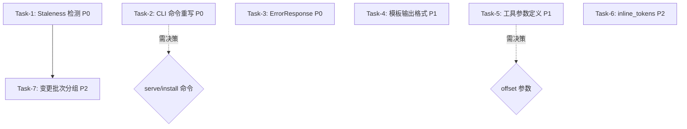

# Gate 1 任务队列 — md-graph 差距修复

> 规划者: dev-genius-planner
> 创建时间: 2026-06-04T17:30:00+08:00
> 上游: Gate 0 差距分析报告 (00-gate0-gap-report.md)
> DI 规格: .di/phases/07_documentation/ (gen-3)
> 状态: 待执行

---

## 总览

| 指标 | 值 |
|------|----|
| 总差距项 | 43 项 |
| 合并后任务数 | 7 个 |
| P0 严重任务 | 3 个 |
| P1 主要任务 | 2 个 |
| P2 次要任务 | 2 个 |
| 需协调器决策 | 2 项 |
| 预估总工时 | 中等 (7 任务, 多数可并行) |

### 架构复杂度分布

| 级别 | 任务数 | 说明 |
|------|--------|------|
| 完整架构 | 0 | 无新建模块或技术栈变更 |
| 影响评估 | 3 | Task-2(CLI), Task-3(ErrorResponse), Task-4(模板) |
| 架构签批 | 4 | Task-1(Staleness), Task-5(工具定义), Task-6(inline_tokens), Task-7(变更批次) |

---

## 任务依赖关系图



### 关键路径

- **关键路径**: Task-1 → Task-7 (2 个任务, 因共享同一文件 database.ts)
- **可并行**: Task-2, Task-3, Task-4, Task-5, Task-6 均可与 Task-1 并行
- **总依赖深度**: 2 层 (最短关键路径)

---

## 任务清单

---

### Task-1: 实现 Staleness 4 字段 stat-only 检测

| 属性 | 值 |
|------|----|
| **编号** | T-001 |
| **严重级别** | P0 |
| **复杂度** | 复杂 |
| **架构复杂度** | 架构签批 |
| **分类** | 重构 (Refactor) |
| **前置任务** | 无 |

**涉及差距**: GAP-STL-001 (只读路径 stale 始终 false, 严重), GAP-STL-002 (watcher 只检查 2 字段, 中等), GAP-STL-003 (违反假阳性优先合约, 严重)

**涉及文件**:
- Modify: `src/storage/database.ts:434-448` — `getStaleInfo()` 实现真实的 4 字段 stat-only 检测
- Modify: `src/analysis/watcher.ts:91-107` — `stalenessCheck()` 补全 4 字段 (file_exists, db_has_record, size, mtimeMs)
- Modify: `src/md-graph.ts:126` — 确保搜索/导航路径调用真实的 stale 检测而非 `getStaleInfo()` 硬编码

**DI 规格依据**: ux-spec/02-staleness-contract.md (stat-only 4 字段检查), 裁决 #6 — stat-only + 横切关注点

**详细描述**:

当前问题: `getStaleInfo()` 始终返回 `stale: false, staleFileCount: 0`，整个 staleness 契约在只读路径上完全失效。需要实现真实的文件系统 stat-only 4 字段检测。

**实现步骤**:

1. 重写 `database.ts` 中 `getStaleInfo()`:
   - 遍历 files 表中所有 active 文件
   - 对每个文件做 4 字段检测: `fs.existsSync(file.path)`, `dbHasRecord`, `stat.size !== file.size`, `stat.mtimeMs !== file.mtimeMs`
   - 任一不匹配则标记为 stale
   - 返回 `{ stale: boolean, staleFileCount: number, staleFilePathList?: string[] }`
   - 遵循「假阳性优先」原则: 如果 stat 调用失败 (文件被锁定等), 保守地标记为 stale

2. 补全 `watcher.ts` 中 `stalenessCheck()`:
   - 增加 `file_exists` 检查 (当前文件是否存在于 FS)
   - 增加 `db_has_record` 检查 (当前文件在 DB 中是否有记录)
   - 保持现有的 size 和 mtimeMs 检查

3. 确保搜索/导航路径 (searcher.ts, traverser.ts, md-graph.ts) 调用真实的 stale 信息:
   - 移除硬编码 `stale: false`
   - 在每次只读查询时调用 `getStaleInfo()` 获取最新 stale 状态

**验收标准** (引用 VALIDATION_PLAN.md):
- ✅ 验证1: 修改一个已索引的 .md 文件内容后，立即调用 `md_search()` 返回 `stale: true`
- ✅ 验证2: 删除一个已索引的 .md 文件后，`md_status` 返回 `staleFileCount > 0`
- ✅ 验证3: `staleFileCount` 的 JSON 类型为 `number` 而非 `array`
- ✅ 验证4: 运行 `npm test -- src/storage/database.test.ts` 全部通过
- ✅ 验证5: 一致性合约 — 不存在的文件路径（误报）返回 `stale: true` 而不是 `stale: false`

---

### Task-2: 重写 CLI 命令匹配 DI 规格

| 属性 | 值 |
|------|----|
| **编号** | T-002 |
| **严重级别** | P0 |
| **复杂度** | 复杂 |
| **架构复杂度** | 影响评估 (涉及 CLI 输出契约变更) |
| **分类** | 重构 (Refactor) |
| **前置任务** | 无 |
| **注意** | GAP-CLI-001 (serve/install 命令) 需协调器先决策后再处理 |

**涉及差距**: GAP-CLI-002 (init 缺少 --force/--incremental, 严重), GAP-CLI-003 (status 缺少 --verbose 和输出字段, 中等), GAP-CLI-004 (uninstall 缺少 --force/--keep-db, 中等), GAP-CLI-005 (输出字段名不符, 中等), GAP-CLI-006 (exit code 未三级区分, 轻微), GAP-CLI-007 (init 默认行为错误, 严重)

**涉及文件**:
- Modify: `src/cli.ts` — 全部命令重写
  - `cmdInit()` (第 51-72 行): 改为默认增量模式 + 支持 --force / --incremental / --dir 参数
  - `cmdStatus()` (第 146-160 行): 改为支持 --verbose, 输出字段补全
  - `cmdUninstall()` (第 165-179 行): 改为支持 --force / --keep-db
  - 处理参数解析 (第 127-141 行): 添加 commander/yargs 或手动解析 --flags
  - 输出格式化: 所有命令输出使用 DI 规格字段名 (`ok` 而非 `success`, 补全缺失字段)
  - exit code: 实现三级退出码 (0=完全成功, 1=部分成功, 2=完全失败)

**DI 规格依据**: architecture-spec/06-mcp-cli-interface.md §CLI 命令层 (gen-3), 裁决 #7 — 3 命令纯 JSON

**详细描述**:

当前 CLI 实现与 DI 规格严重不符。需要全面重写以匹配 DI 定义的 3 命令规范。

**cmdInit 实现要点**:
- 默认行为: 如果 `.md-graph` 目录已存在, 调用 `Indexer.incrementalIndex()` 做增量更新 (stat 4 字段检测差异, 只 reindex 变更文件), 而非返回错误
- `--force` 标志: 跳过 mtime 检测, 全量重建索引 (删除旧索引后重新扫描)
- `--incremental` 标志: 显式指定增量模式 (默认已有此行为, 提供显式标志用于 agent 明确表达意图)
- `--dir <path>`: 指定项目根目录
- 输出 JSON 字段: `ok`, `mode` ("full"|"incremental"), `indexedCount`, `skippedCount`, `failedCount`, `failedFiles`, `totalFiles`, `totalNodes`, `totalEdges`, `durationMs`, `lastIndexedAt`

**cmdStatus 实现要点**:
- 默认输出: `initialized`, `projectDir`, `totalFiles`, `totalNodes`, `totalEdges`, `staleFileCount`, `lastIndexedAt`, `watcherActive`
- `--verbose` 标志: 额外输出 `staleFilePathList`, `pendingFileCount`, `lastIndexDurationMs`
- 字段统一使用 `ok` 而非 `success`

**cmdUninstall 实现要点**:
- 默认行为: 删除 SQLite 数据库 + MCP 配置
- `--keep-db` 标志: 仅移除 MCP 配置, 保留数据库文件
- `--force` 标志: 跳过确认检查
- 输出 JSON: `ok`, `action` ("full_uninstall"|"config_only"), `dbPath`, `dbRemoved`, `durationMs`

**全局规范**:
- stdout: 纯 JSON, 无 ANSI, 无进度条, 无表格
- stderr: 仅文本错误/警告
- exit code: 0=完全成功, 1=部分成功, 2=完全失败

**验收标准** (引用 VALIDATION_PLAN.md):
- ✅ 验证1: `md-graph init --force` 在已索引项目上全量重建, 返回 `ok: true, mode: "full"`
- ✅ 验证2: `md-graph init` (无参数) 在已索引项目上增量更新, 返回 `ok: true, mode: "incremental"`
- ✅ 验证3: `md-graph status --verbose` 输出包含所有 DI 要求的字段, 且字段名为 `ok` 而非 `success`
- ✅ 验证4: `md-graph uninstall --keep-db` 仅移除配置, 保留数据库
- ✅ 验证5: 输出为纯 JSON (`stdout`), 零 UI 元素
- ✅ 验证6: 部分失败场景 exit code = 1, 完全失败场景 exit code = 2
- ✅ 验证7: `npm test -- src/cli.test.ts` 全部通过

---

### Task-3: 实现 ErrorResponse 结构化错误处理

| 属性 | 值 |
|------|----|
| **编号** | T-003 |
| **严重级别** | P0 |
| **复杂度** | 复杂 |
| **架构复杂度** | 影响评估 (修改 MCP 协议层的错误响应格式) |
| **分类** | 重构 (Refactor) |
| **前置任务** | 无 |

**涉及差距**: GAP-MCP-005 (错误以 JSON-RPC 协议错误返回, 严重), GAP-MCP-006 (未使用 DI 错误码字符串, 中等), GAP-ERR-001 (错误格式不匹配 ErrorResponse, 严重), GAP-ERR-002 (toText 格式不匹配三段式, 中等), GAP-ERR-003 (错误码未按 DI 实现, 中等), GAP-ERR-004 (未实现 INDEX_NOT_INITIALIZED 特殊处理, 轻微)

**涉及文件**:
- Modify: `src/types.ts` — 修正 `MdGraphError.toText()` 格式, 添加错误码常量引用
- Modify: `src/api/mcp-server.ts` — 将错误返回方式从 JSON-RPC 协议错误改为 MCP content 级 ErrorResponse
  - `handleToolsCall()` 第 232-248 行: 错误捕获改为返回 `ToolResult.isError: true`
  - `callStatus()`, `callSearch()`, `callNavigate()`: 参数校验错误使用结构化 ErrorResponse
  - `noProject()`: 改为返回结构化 ErrorResponse 而非自然语言文本

**DI 规格依据**: ux-spec/03-error-patterns.md (三段式 ErrorResponse), architecture-spec/06-mcp-cli-interface.md (§错误码清单), 裁决 #9 — isError + 文本

**详细描述**:

当前 MCP 服务器将所有错误通过 JSON-RPC 协议错误返回 (code -32603 或 -32602), 而非嵌入到 MCP 响应 content 中。agent 无法通过编程方式获取结构化的 `code`, `cause`, `fix`, `recoverable` 字段, 只能解析纯文本。

**实现步骤**:

1. 在 `mcp-server.ts` 中创建一个辅助函数 `makeErrorResponse(code, message, cause, fix, recoverable)`:
   ```
   返回格式:
   {
     content: [{ type: 'text', text: '问题描述: {message}\n原因: {cause}\n修复: {fix}' }],
     isError: true
   }
   ```
   注意: 根据 MCP 协议, `isError` 标记在 `ToolResult` 顶层, 而不是在 content 项内部。

2. 修改 `handleToolsCall()` 中的 catch 分支 (第 232-248 行):
   - 不再是返回 `{ jsonrpc, id, error: { code, message } }`
   - 而是: 捕获 `MdGraphError`, 提取其 `code`, `message`, `cause`, `fix`, `recoverable` 字段
   - 返回包含 `isError: true` 的 `ToolResult`
   - 在 `result.text` 中嵌入三段式文本: `问题: {message}\n原因: {cause}\n修复: {fix}`

3. 参数验证错误处理 (第 240-247 行):
   - 参数缺失或无效时返回 `INVALID_PARAMETER` 错误码
   - 而不是通用的 `-32602` JSON-RPC 错误

4. 修改 `MdGraphError.toText()` (types.ts 第 95-97 行):
   - 保持中文自然语言, 但确保字段名与 DI 一致
   - 输出格式: `{message}\n{cause}\n{fix}` (共 3 行)

5. 添加 DI 定义的错误码引用 (建议常量对象):
   ```typescript
   const ErrorCodes = {
     INVALID_QUERY: 'INVALID_QUERY',
     INVALID_PATH: 'INVALID_PATH',
     INDEX_NOT_INITIALIZED: 'INDEX_NOT_INITIALIZED',
     INVALID_PARAMETER: 'INVALID_PARAMETER',
     WATCHER_NOT_READY: 'WATCHER_NOT_READY',
     INTERNAL_ERROR: 'INTERNAL_ERROR',
   };
   ```

6. 修改 `noProject()` 方法 (第 256-260 行):
   - 返回 ErrorResponse 格式: `isError: true, code: INDEX_NOT_INITIALIZED, message: "...", cause: "...", fix: "运行 md-graph init", recoverable: true`
   - 保留原有的中文友好提示作为 text 内容

**验收标准** (引用 VALIDATION_PLAN.md):
- ✅ 验证1: 未初始化项目时调用 `md_search`, 返回 `ToolResult.isError: true` 且 `code: "INDEX_NOT_INITIALIZED"`
- ✅ 验证2: `md_navigate` 传入不存在的路径, 返回 `isError: true` 且 `code: "INVALID_PATH"`
- ✅ 验证3: 错误响应 text 包含三段式: message + cause + fix (非 JSON-RPC 错误格式)
- ✅ 验证4: `INTERNAL_ERROR` 的 `recoverable: false`, 其余 `recoverable: true`
- ✅ 验证5: `npm test -- src/api/mcp-server.test.ts` 全部通过
- ✅ 验证6: 不存在 `-32602` 或 `-32603` 的 JSON-RPC 错误返回 (所有错误都走 content-level)

---

### Task-4: 重写自然语言模板输出格式匹配 DI 规格

| 属性 | 值 |
|------|----|
| **编号** | T-004 |
| **严重级别** | P1 |
| **复杂度** | 复杂 |
| **架构复杂度** | 影响评估 (修改三个工具的输出契约) |
| **分类** | 重构 (Refactor) |
| **前置任务** | 无 (与 Task-3 可并行) |

**涉及差距**: GAP-TPL-001 (md_status 输出缺少索引状态元数据行, 中等), GAP-TPL-002 (md_search 输出格式不匹配, 中等), GAP-TPL-003 (md_navigate 输出格式严重不匹配, 严重), GAP-TPL-004 (空结果格式不符, 中等), GAP-TPL-005 (预定义模板与新版共存, 轻微), GAP-MCP-007 (_next 引导格式不符, 中等), GAP-MISC-002 (两套渲染机制, 轻微)

**涉及文件**:
- Modify: `src/api/template.ts` — 全部重置
  - 删除 `PREDEFINED_TEMPLATES` (第 51-90 行)
  - 删除 `render()` / `renderTemplate()` / `registerTemplate()` (第 107-131 行) — 不再需要通用模板引擎
  - 删除 `renderNextTags()` / `renderEachBlocks()` / `renderConditionalBlocks()` / `renderVariables()` (第 137-189 行)
  - 重写 `renderStatus()` (第 194-229 行) — 按 DI 规格格式输出
  - 重写 `renderSearch()` (第 235-255 行) — 按 DI 规格格式输出
  - 重写 `renderNavigate()` (第 260-283 行) — 按 DI 规格格式输出
  - 所有渲染方法末尾添加 staleness 三字段元数据行
  - 所有渲染方法末尾添加 `【务必】` + `【不要】` _next 引导块
- Modify: `src/api/mcp-server.ts` — 调用方适配新模板接口 (如有变动)

**DI 规格依据**: architecture-spec/06-mcp-cli-interface.md §返回格式 (§md_status/md_navigate/md_search), 《裁决 #11》空状态自然语言

**详细描述**:

当前模板输出格式与 DI 规格存在系统性差异。标题格式、字段、_next 引导格式、staleness 元数据行全部需要重置。同时两套渲染机制 (PREDEFINED_TEMPLATES + renderStatus/Search/Navigate) 必须清理为单一路径。

**renderStatus 新格式** (参考 architecture-spec/06-mcp-cli-interface.md 第 72-108 行):
```
## 最近变更 ({batchCount} 批)

### 批次 {index}: {timeWindow} — {fileCount} 个文件变更

- **{fileName}** ({type}, {path})
  行 {lineRanges} · {headingPath}
  {keywords_line}
  {related_line}

【务必】使用 Read 工具读取上方文件路径和行号...{search_hint}
【不要】假设以上文件列表完整——未出现在变更列表中的文件可能仍包含相关内容。
索引状态: {stale? 过期 : 新鲜} | 过期文件数: {staleFileCount} | 最后索引时间: {lastIndexedAt}
```

**renderSearch 新格式** (参考第 184-224 行):
```
## 搜索 "{query}" — {totalResults} 条结果

{index}. **{fileName}** ({path}) 行 {lineRanges} · 相关度 {score}
   所属: {headingPath}
   片段: {snippet}
   {related_line}

【务必】使用 Read 工具读取上方文件路径和行号查看完整上下文。{navigate_hint}
【不要】仅凭片段判断完整内容...
索引状态: ... | 过期文件数: ... | 最后索引时间: ...
```

**renderNavigate 新格式** (参考第 129-165 行):
```
## {fileName} 的链接关系

文件主题: {topic}

### {directionLabel} (depth={depth})

- → **{targetFileName}** ({targetPath})
  行 {sourceLineRanges} · 链接文字: "{linkText}"
  主题: {targetTopic}

共 {totalLinks} 条{directionLabel}。
【务必】使用 Read 工具读取上方目标文件。depth 参数可扩大遍历层数...
【不要】仅凭链接文字判断目标文档内容...
索引状态: ... | 过期文件数: ... | 最后索引时间: ...
```

**空结果处理** (裁决 #11):
- `renderSearch` 在 totalResults=0 时输出:
  ```
  ## 搜索 "{query}" — 0 条结果
  
  未找到匹配内容。可简化查询词或使用 md_status 检查索引覆盖范围。
  ```
- `renderNavigate` 在 totalLinks=0 时输出:
  ```
  Navigation Results (0 links found for this file)
  ```

**清理工作**:
- 删除 `PREDEFINED_TEMPLATES` 对象 (第 51-90 行)
- 删除通用渲染方法 `render()`, `renderTemplate()`, `registerTemplate()` 及其辅助方法
- 保留 `renderStatus()`, `renderSearch()`, `renderNavigate()` 三个专用方法
- 更新 `TemplateData` 及其子类型接口以匹配 DI 数据字段

**验收标准** (引用 VALIDATION_PLAN.md):
- ✅ 验证1: `md_status` 输出格式完全匹配 DI 规格 (标题、批次、文件条目、_next、staleness 行)
- ✅ 验证2: `md_search` 输出格式完全匹配 DI 规格 (标题、结果序号、相关度、关联行、_next、staleness 行)
- ✅ 验证3: `md_navigate` 输出格式完全匹配 DI 规格 (标题、主题、方向深度、链接条目、_next、staleness 行)
- ✅ 验证4: 空结果时 md_search 输出自然语言文本 `"## 搜索 \"{query}\" — 0 条结果\n\n未找到匹配内容..."`
- ✅ 验证5: 每个响应末尾包含 staleness 三字段 (stale/staleFileCount/lastIndexedAt)
- ✅ 验证6: 每个响应末尾包含 `【务必】...` + `【不要】...` 引导块
- ✅ 验证7: 代码中不再存在 `PREDEFINED_TEMPLATES` (已删除)
- ✅ 验证8: `npm test -- src/api/template.test.ts` 全部通过

---

### Task-5: 更新 MCP 工具参数定义和描述

| 属性 | 值 |
|------|----|
| **编号** | T-005 |
| **严重级别** | P1 |
| **复杂度** | 中等 |
| **架构复杂度** | 架构签批 |
| **分类** | 新功能 (Feature) |
| **前置任务** | 无 |
| **注意** | GAP-MCP-004 (offset 参数) 需协调器决策是否保留 |

**涉及差距**: GAP-MCP-001 (md_status 缺少 batches/since/limit 参数, 严重), GAP-MCP-002 (md_navigate 缺少 maxResults 参数, 中等), GAP-MCP-003 (direction 枚举描述用中文, 轻微), GAP-SRV-002 (md_status 描述未提及批次参数, 轻微), GAP-SRV-003 (工具中英文混杂, 轻微)

**涉及文件**:
- Modify: `src/api/server-instructions.ts` — 更新工具参数定义和描述
  - `getToolDefinitions()`: 为 `md_status` 添加 `batches`, `since`, `limit` 参数; 为 `md_navigate` 添加 `maxResults` 参数
  - `createServerInstructions()`: 更新 md_status 描述提及批次参数; 统一中英文描述

**DI 规格依据**: architecture-spec/06-mcp-cli-interface.md §MCP 工具层 (gen-3)

**详细描述**:

当前 MCP 工具定义缺少 DI 规格要求的多个参数, 且描述内容与 DI 规格不一致。

**实现步骤**:

1. 在 `getToolDefinitions()` 中为 `md_status` 的 `inputSchema` 添加三个可选参数:
   ```typescript
   batches?: { type: 'number', description: '时间批次数量（默认 3）' }
   since?: { type: 'string', description: 'ISO 8601 时间戳过滤（如 2026-06-03T14:00:00Z）' }
   limit?: { type: 'number', description: '每批次最大文件数（默认 50）' }
   ```

2. 在 `getToolDefinitions()` 中为 `md_navigate` 添加 `maxResults` 参数:
   ```typescript
   maxResults?: { type: 'number', description: '最大返回链接数（默认 20, 最大 100）' }
   ```

3. 更新 `createServerInstructions()` 中 `md_status` 的描述文本:
   - 明确提及变更批次 (batches) 概念和 `batches`, `since`, `limit` 参数
   - 描述中提到的参数应与工具定义保持一致

4. 统一中英文描述:
   - 工具 description 字段保持英文 (MCP 协议标准)
   - `createServerInstructions()` 中详细描述使用中文

5. 关于 `offset` 参数 (GAP-MCP-004): 当前 `md_search` 实现了 DI 未要求的 `offset` 参数。此参数可作为对 `maxResults` 的补充保留, 但需协调器确认。暂时保留, 标记为等待决策。

**验收标准**:
- ✅ 验证1: `tools/list` 返回的 md_status 定义包含 `batches`, `since`, `limit` 三个可选参数
- ✅ 验证2: `tools/list` 返回的 md_navigate 定义包含 `maxResults` 参数
- ✅ 验证3: 使用 `batches=2` 调用 md_status 时只返回 2 个批次
- ✅ 验证4: `npm test -- src/api/server-instructions.ts` 全部通过 (如有测试)

---

### Task-6: 实现 inline_tokens 关键词提取

| 属性 | 值 |
|------|----|
| **编号** | T-006 |
| **严重级别** | P2 |
| **复杂度** | 简单 |
| **架构复杂度** | 架构签批 |
| **分类** | 新功能 (Feature) |
| **前置任务** | 无 |

**涉及差距**: GAP-TPL-006 (关键词字段未渲染, 轻微), GAP-MISC-003 (inline_tokens 未填充, 轻微)

**涉及文件**:
- Modify: `src/analysis/parser/md-parser.ts`
  - `parse()` (第 47-123 行): 在解析 markdown-it token 流时, 提取 inline token 中的 bold/italic/code 信息
  - `makeNode()` (第 312-336 行): 为 `DocNode` 填充 `inlineTokens` 字段

**DI 规格依据**: architecture-spec/03-data-model.md §doc_nodes.inline_tokens, architecture-spec/06-mcp-cli-interface.md §变更详情数据来源

**详细描述**:

当前 `md-parser.ts` 的 `parse()` 方法不提取 inline token 信息 (bold/italic/code), 导致 `DocNode.inlineTokens` 字段始终为空。需要解析 markdown-it token 流中的 inline token 信息。

**实现步骤**:

1. 在 `parse()` 方法中, 遍历 markdown-it token 流时, 对 type='inline' 的 token 做二次遍历:
   - 查找 children 中 type 为 `strong`, `em`, `code` 的 token
   - 收集对应的文本内容
   - 分组到 `boldTerms`, `italicTerms`, `codeTerms` 三个数组

2. 在 `makeNode()` 方法中, 将收集到的 inline token 信息序列化为 JSON 填入 `inlineTokens` 字段:
   ```json
   {
     "boldTerms": ["重要", "关键"],
     "italicTerms": ["注"],
     "codeTerms": ["npm install"]
   }
   ```

3. 保持与现有代码的兼容性 — 如果 `inlineTokens` 为空, 模板渲染时 `keywords_line` 应整行省略 (Task-4 已处理)。

**验收标准**:
- ✅ 验证1: 解析包含 `**加粗**` 的 .md 文件, DocNode 的 inlineTokens 包含 `boldTerms: ["加粗"]`
- ✅ 验证2: 解析包含 `*斜体*` 的 .md 文件, DocNode 的 inlineTokens 包含 `italicTerms: ["斜体"]`
- ✅ 验证3: 解析包含 `` `代码` `` 的 .md 文件, DocNode 的 inlineTokens 包含 `codeTerms: ["代码"]`
- ✅ 验证4: 不含 inline 标记的纯文本段落, inlineTokens 为 null 或空对象
- ✅ 验证5: `npm test -- src/analysis/parser/md-parser.test.ts` 全部通过

---

### Task-7: 修复变更批次分组为 ±15 分钟窗口

| 属性 | 值 |
|------|----|
| **编号** | T-007 |
| **严重级别** | P2 |
| **复杂度** | 简单 |
| **架构复杂度** | 架构签批 |
| **分类** | Bug 修复 |
| **前置任务** | Task-1 (共用 database.ts, 建议顺序执行) |

**涉及差距**: GAP-MISC-001 (变更按日期分组而非 ±15 分钟窗口, 中等)

**涉及文件**:
- Modify: `src/storage/database.ts` — `getChangeBatches()` (第 484-539 行)
  - 将分组算法从日期分组 (YYYY-MM-DD) 改为 ±15 分钟时间窗口分组
  - 时间窗口标签格式: `"14:32 ± 15min"`

**DI 规格依据**: architecture-spec/06-mcp-cli-interface.md §md_status 变更分组逻辑, ADR-009

**详细描述**:

当前 `getChangeBatches()` 按日期 (YYYY-MM-DD) 分组变更文件, 但 DI 规格要求按 ±15 分钟时间窗口分组。agent 的注意力更适合按「批次」理解变更 (如"14:32 左右有 3 个文件一起改了"), 而不是按天分组。

**实现步骤**:

1. 重写分组算法:
   - 从 files 表读取 `last_change_details` (包含变更时间戳)
   - 按 ±15 分钟窗口聚合: 如果两个文件的变更时间差 < 30 分钟, 归入同一批次
   - 窗口标签格式: `"{time} ± 15min"`, 如 `"14:32 ± 15min"`
   - 按时间倒序排列批次 (最新的在前)

2. 更新 `StatusTemplateData` 接口以包含 DI 的 `timeWindow` 字段格式

**验收标准**:
- ✅ 验证1: 在 14:30 和 14:35 修改的两个文件出现在同一批次中 (同属 ±15min 窗口)
- ✅ 验证2: 在 14:30 和 15:00 修改的两个文件出现在不同批次中 (超出窗口范围)
- ✅ 验证3: 时间窗口标签格式为 `"{time} ± 15min"` (如 `"14:32 ± 15min"`)
- ✅ 验证4: 批次按时间倒序排列 (最新批次在前)
- ✅ 验证5: `npm test -- src/storage/database.test.ts` 全部通过

---

## 需协调器决策事项

以下差距涉及设计方向决策, 不能由 Planner 单方面决定, 需要协调器裁决:

### 决策 1: serve 和 install 命令去留 (GAP-CLI-001)

**问题**: 当前 CLI 额外实现了 DI 未定义的 `serve` 和 `install` 命令。
- `serve` (src/cli.ts 第 183-228 行): 启动 MCP 服务器
- `install` (src/cli.ts 第 233-248 行): 安装 MCP 配置到 Claude Code

**选项**:
- A. 删除这两个命令, 严格对齐 DI 的 3 命令规格
- B. 保留, 作为扩展功能 (需确认不影响 agent 的工具选择正确率)
- C. 保留 serve, 删除 install (install 功能可由 MCP 配置手动完成)

**影响**: 如果删除, Task-2 需要额外清理相关代码。如果保留, 需在 SERVER_INSTRUCTIONS 中说明 CLI 命令集包含扩展命令。

### 决策 2: md_search 的 offset 参数去留 (GAP-MCP-004)

**问题**: 当前 `md_search` 实现了 DI 未要求的 `offset` 参数用于分页。该参数不在 DI 规格的 `SearchInput` 接口中。

**选项**:
- A. 删除 offset 参数, 严格对齐 DI 规格
- B. 保留, 作为对 maxResults 的合理补充 (分页场景)

**建议**: 建议保留 offset, 因为分页是合理的扩展, 不影响 DI 定义的核心行为。

---

## ⚠️ 向协调器汇报

**汇报类型**: 计划调整 / 决策请求

**问题描述**:
1. 43 项差距已合并为 7 个任务, 其中 3 个 P0 任务可完全并行执行
2. 2 项决策 (serve/install 命令 + offset 参数) 需要协调器确认后再纳入 Task-2 和 Task-5
3. 所有 7 个任务均不需要「完整架构」级别的架构评审, 最高为「影响评估」

**建议方案**:
- P0 任务 (Task-1, 2, 3) 优先安排, 可并行分配给 3 个 Developer
- P1 任务 (Task-4, 5) 在 P0 之后或与之并行
- P2 任务 (Task-6, 7) 可最后处理, 不影响核心功能
- 协调器确认决策 1 和决策 2 后, 更新 Task-2 和 Task-5 的范围

**影响范围**: 任务队列已就绪, 待协调器确认后即可分配给 Architect (Gate 2) 和 Developer。

---

## 任务执行排序建议

```
阶段 1: P0 并行 (3 个任务同时进行)
  ├── Task-1: Staleness 检测       → src/storage/database.ts, src/analysis/watcher.ts
  ├── Task-2: CLI 命令重写          → src/cli.ts (需待协调器确认 serve/install 决策)
  └── Task-3: ErrorResponse         → src/api/mcp-server.ts, src/types.ts

阶段 2: P1 并行 (与阶段 1 部分重叠)
  ├── Task-4: 模板输出格式          → src/api/template.ts
  └── Task-5: 工具参数定义          → src/api/server-instructions.ts

阶段 3: P2 串行 (在 Task-1 之后)
  ├── Task-7: 变更批次分组          → src/storage/database.ts (依赖 Task-1)
  └── Task-6: inline_tokens         → src/analysis/parser/md-parser.ts
```

---

## 附件: 差距-任务映射表

| 差距编号 | 严重级别 | 映射任务 | 分类 | 涉及文件 |
|----------|---------|---------|------|---------|
| GAP-MCP-001 | 严重 | Task-5 | 工具定义 | server-instructions.ts |
| GAP-MCP-002 | 中等 | Task-5 | 工具定义 | server-instructions.ts |
| GAP-MCP-003 | 轻微 | Task-5 | 工具定义 | server-instructions.ts |
| GAP-MCP-004 | 轻微 | 待决策 | — | server-instructions.ts |
| GAP-MCP-005 | 严重 | Task-3 | 错误处理 | mcp-server.ts + types.ts |
| GAP-MCP-006 | 中等 | Task-3 | 错误处理 | mcp-server.ts + types.ts |
| GAP-MCP-007 | 中等 | Task-4 | 模板输出 | template.ts |
| GAP-TPL-001 | 中等 | Task-4 | 模板输出 | template.ts |
| GAP-TPL-002 | 中等 | Task-4 | 模板输出 | template.ts |
| GAP-TPL-003 | 严重 | Task-4 | 模板输出 | template.ts |
| GAP-TPL-004 | 中等 | Task-4 | 模板输出 | template.ts |
| GAP-TPL-005 | 轻微 | Task-4 | 模板输出 | template.ts |
| GAP-TPL-006 | 轻微 | Task-6 | inline_tokens | md-parser.ts |
| GAP-CLI-001 | 严重 | 待决策 | CLI | cli.ts |
| GAP-CLI-002 | 严重 | Task-2 | CLI | cli.ts |
| GAP-CLI-003 | 中等 | Task-2 | CLI | cli.ts |
| GAP-CLI-004 | 中等 | Task-2 | CLI | cli.ts |
| GAP-CLI-005 | 中等 | Task-2 | CLI | cli.ts |
| GAP-CLI-006 | 轻微 | Task-2 | CLI | cli.ts |
| GAP-CLI-007 | 严重 | Task-2 | CLI | cli.ts |
| GAP-STL-001 | 严重 | Task-1 | Staleness | database.ts + watcher.ts |
| GAP-STL-002 | 中等 | Task-1 | Staleness | database.ts + watcher.ts |
| GAP-STL-003 | 严重 | Task-1 | Staleness | database.ts + watcher.ts |
| GAP-ERR-001 | 严重 | Task-3 | 错误处理 | mcp-server.ts |
| GAP-ERR-002 | 中等 | Task-3 | 错误处理 | types.ts |
| GAP-ERR-003 | 中等 | Task-3 | 错误处理 | mcp-server.ts + types.ts |
| GAP-ERR-004 | 轻微 | Task-3 | 错误处理 | mcp-server.ts |
| GAP-SRV-002 | 轻微 | Task-5 | 工具定义 | server-instructions.ts |
| GAP-SRV-003 | 轻微 | Task-5 | 工具定义 | server-instructions.ts |
| GAP-MISC-001 | 中等 | Task-7 | 变更批次 | database.ts |
| GAP-MISC-002 | 轻微 | Task-4 | 模板输出 | template.ts |
| GAP-MISC-003 | 轻微 | Task-6 | inline_tokens | md-parser.ts |
